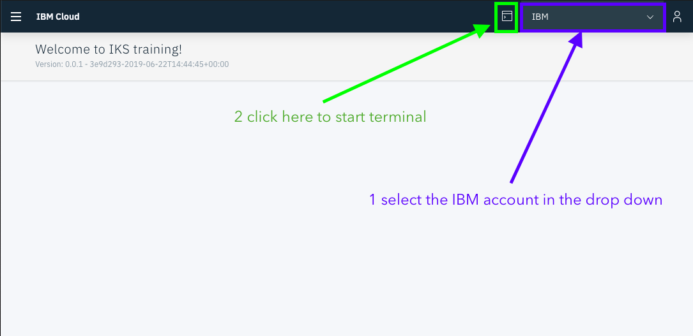

# Setup

## Get Started

[Click this link to get started](https://cloud.ibm.com/registration?cm_mmc=Email_Events-_-Developer_Innovation-_-WW_WW-_-advocates:mofizur-rahman\title:midatlanticdevelopersconference-maryland-812019-822019\eventid:5d165eac09329b5504d429e7\date:Aug2019\type:workshop\team:global-devadvgrp-newyork\city:maryland\country:unitedstates\contents:kubernetes-101-labs&cm_mmca1=000019RS&cm_mmca2=10004805&cm_mmca3=M99938765&eventid=5d165eac09329b5504d429e7&cvosrc=email.Events.M99938765&cvo_campaign=000019RS)

## Get Access to Kubernetes Cluster

Once you have you account all set up, it's time to get access to a kubernetes cluster. 

Lab Key: 

```text
kube201!
```

[Grant Cluster](https://kube201.mybluemix.net)


Use the lab key and your IBMid, click agree and submit. This will do some iam magic and connect a 3 node cluster with your account.

## Get Cloud Shell

[Get Access to Cloud Shell](https://cloudshell-pyrk8s-ba.us-south.cf.cloud.ibm.com/)

If it asks for a password use : **`PyRk8sBA`** 



> **Select IBM from the dropdown.**

_Cloud shell is a tmux based shell._ 

_Quick note on tmux_

```text
Ctrl+b " — split pane horizontally.
Ctrl+b % — split pane vertically.
Ctrl+b arrow key — switch pane.
Hold Ctrl+b, don't release it and hold one of the arrow keys — resize pane.
Ctrl+b c — (c)reate a new window.
Ctrl+b n — move to the (n)ext window.
Ctrl+b p — move to the (p)revious window.
```

## Login to IBM Cloud

When using the cloud shell it should already log you to the user you selected in the drop down.

```text
ibmcloud account list
```

This should return 2 results.

If it says not logged in login using `ibmcloud login` and choose the ibm account when prompted.

## Get Kubectl Access to Cluster

To see the cluster you have access to run

```text
ibmcloud ks clusters
```

That should show you a cluster .

Now lets setup `kubectl` to work with that cluster.

Run

```text
ibmcloud ks cluster-config <your-cluster-name>
```

This will print out the `export KUBECONFIG=<string>`

Paste that in the terminal. To test that went successfully

```text
kubectl get nodes
```

You should see three nodes. 

## Clone Repo

All the example code and yaml files are in github. 

```text
git clone https://github.com/moficodes/k8s-second-week.git
```

```text
cd k8s-second-week
```

Now we are ready to rock and roll.

