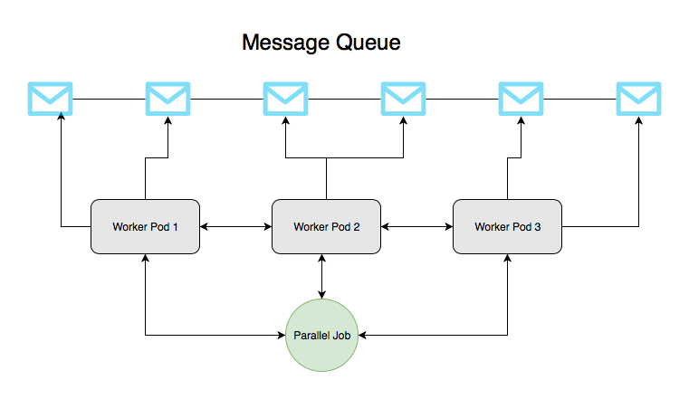

# Jobs

Job is another Kubernetes primitive.

Before we go any further, I should mention, the things to be done with Job can also be done with Bare Pods or Replication Controller. So why Jobs then

* Jobs can survive cluster restart. If you had a pretty big amount data to be crunched and that could run for hours, you have to accept the fact that some cluster wide disruption may occur.  Jobs can restart back after the disruption.
* Job can run in parallel or can be run multiple times.


Few things to note about jobs.

* completions: how many times we want this jobs to complete. we can also thing this as the number of workers in a pool.
* parallelism: how many of those workers should run in parallel.
* activeDeadlineSeconds: to time out jobs that might be taking too long.

A job is complete when the underlying container exits.

To run the example we have 

```text
kubectl apply -f k8s/jobs/jobs.yaml
```

The job basically runs the `busybox` image and sleeps for 3 second for 10 completion sequentially.

open the file using nano or vi

```text
nano k8s/jobs/jobs.yaml
```

There are a couple of lines that are commented out.

Uncomment the `parallelism` line.

Delete the job. 

```text
kubectl delete jobs job-sleep
```

Rerun the job

```text
kubectl apply -f k8s/jobs/jobs.yaml
```

This time we should see jobs running 2 at a time.

Finally try out the deadline by uncommenting the  `activeDeadlineSeconds` field. Delete the job and rerun.

How many jobs did we complete this time?


## Jobs Use case



In the [real-world scenario](https://kubernetes.io/docs/tasks/job/fine-parallel-processing-work-queue/), we could imagine a Redis list with some work items \(e.g messages, emails\) in it and three parallel worker pods created by the Job \(see the Image above\). Each pod could have a script to requests a new message from the list, process it, and check if there are more work items left. If no more work items exist in the list, the pod accessing it would exit with success telling the controller that the work was successfully done. This notification would cause other pods to exit as well and the entire job to complete. Given this functionality, parallel jobs with a work queue are extremely powerful in processing large volumes of data with multiple workers doing their tasks in parallel.


